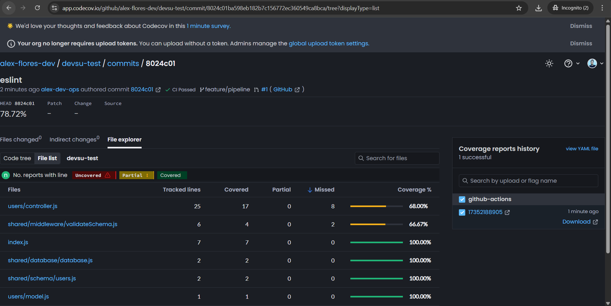
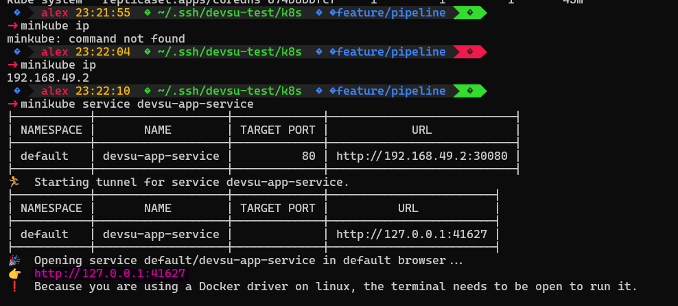
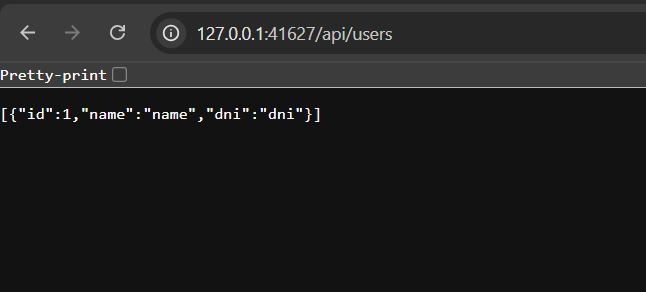

# Diagrama de pipelines CI/CD

Este diagrama representa tus pipelines de GitHub Actions para Node.js y Kubernetes.

```
    subgraph CI ["Node.js CI/CD Pipeline (ci.yaml)"]
        A1[Push a main / PR] --> B1[Checkout repository]
        B1 --> C1[Setup Node.js v22]
        C1 --> D1[Install dependencies (npm ci)]
        D1 --> E1[Install ESLint]
        E1 --> F1[Run ESLint]
        F1 --> G1[Run Jest tests with coverage]
        G1 --> H1[Upload coverage to Codecov]
        H1 --> I1[Build Docker image ghcr.io/alex-flores-dev/devsu:latest]
        I1 --> J1[Login to Docker Hub]
        J1 --> K1[Tag Docker image for Docker Hub]
        K1 --> L1[Push Docker image to Docker Hub]
    end

    subgraph CD ["Kubernetes Deploy Pipeline (cd.yaml)"]
        A2[Push a main] --> B2[Checkout repository]
        B2 --> C2[Setup kubectl v1.28.0]
        C2 --> D2[Configure Kubeconfig from secret]
        D2 --> E2[Apply manifests from k8s/]
    end
```
# Notas
 Se utilizo Codecov para el coverage del codigo
 <p align="center">
  
</p>
# Explicación de los pipelines CI/CD

## CI Pipeline (`ci.yaml`)

- Se ejecuta en **pushes** y **pull requests** al branch `main`.
- Instala **Node.js**, dependencias y **ESLint**.
- Ejecuta **tests con Jest** y sube la cobertura a **Codecov**.
- Construye y sube la **imagen Docker** al registro y Docker Hub.

## CD Pipeline (`cd.yaml`)

- Se ejecuta solo en **pushes** al branch `main`.
- Configura **kubectl** usando un **secreto de GitHub**.
- Aplica los **manifiestos de Kubernetes** desde el directorio `k8s/`.

## Flujo integrado

- El pipeline de **CI** construye y publica la **imagen Docker**.
- El pipeline de **CD** despliega esa imagen en **Kubernetes** usando los manifiestos.

---
## DEPLOYMENT MINIKUBE

- Para verificar que funciona correctamente se uso minikube por temas de tiempo
 <p align="center">
  
</p>
- Verificamos que la aplicacion este funcionando en el minikubeip

 <p align="center">
  
</p>
---

## IAC

- Se agrego los archivos terraform para la infraestructura en AWS, hubo un problema con mi cuenta por eso no se pudo deployar en EKS

## 💡 Mejoras e next steps

- Se utilizan **Secrets de GitHub** para `kubeconfig`, Docker Hub y Codecov.  
- CI es independiente de CD, pero genera artefactos (imagen Docker) que luego CD despliega.  
- Se utilizaron **Sealed Secrets** para una mejor gestión de secretos.  
- Idealmente, se debería usar **Argo CD** o **FluxCD** para implementar un flujo GitOps efectivo.  
- Para Code Coverage, lo ideal sería integrar **SonarQube** u otra herramienta profesional (no gratuita).  
- Se recomienda crear **Jobs y templates reutilizables** en GitHub siguiendo patrones de diseño.  
- Se debería agregar un **análisis de seguridad de las imágenes**, aunque no se logró por el tiempo disponible.
